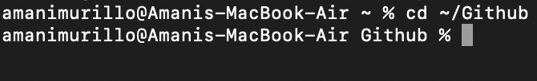
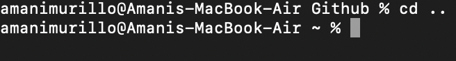
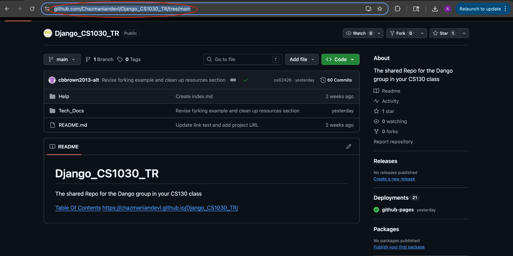
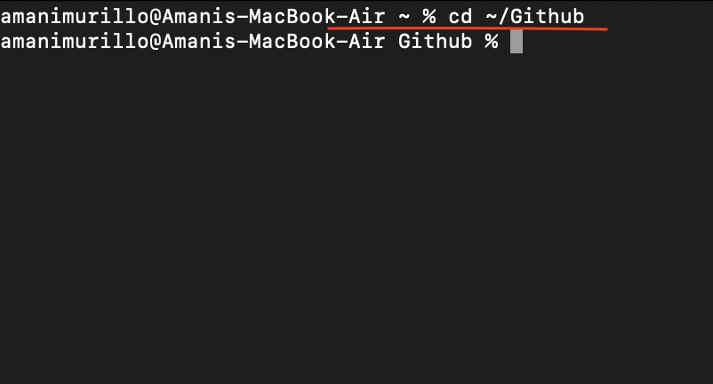
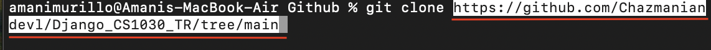
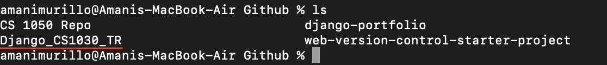
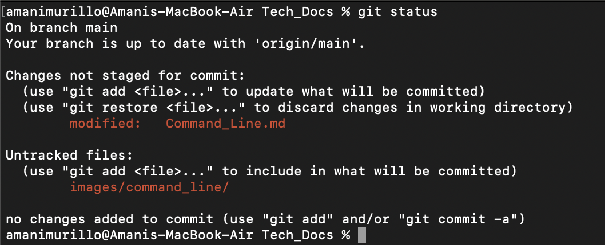
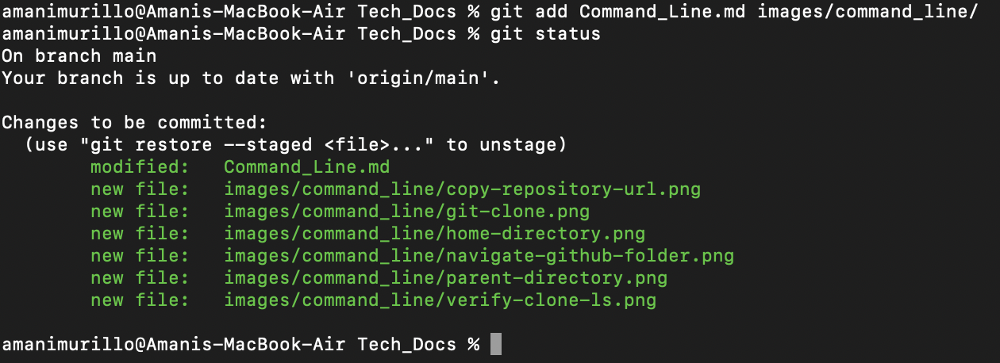
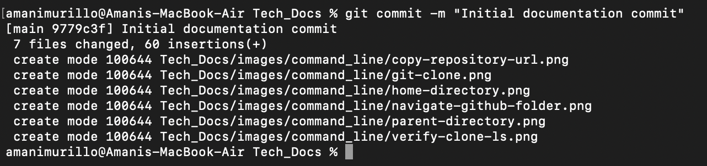
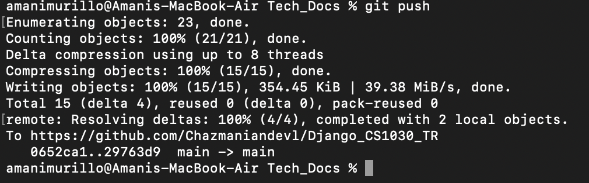

# Table of Contents

- [Basic Commands](#basic-commands)
- [Git Commands](#git-commands)
- [Cloning Repository](#cloning-repository)
- [Committing with Terminal](#committing-with-terminal)
- [Common Problems and solutions](#common-problems-and-solutions)

# Basic Commands

| Command | Description |
| :---: | --- |
| **pwd** | Returns the directory you are currently in |
| **cd** | Navigates between files/folders in your computer |
| **ls** | Lists the files and folders in directory |
| **mkdir** | Makes a new directory |
| **code .** | Opens current folder inside of VS Code |
| **mv** | Moves or renames a file/directory |
| **rm** | Deletes a file name (Be careful using) |

## Short Cuts

**“~”** is used to represent your home directory. Using **“cd ~/Folder”** will take you from your home directory to a new folder.

**“. .”** can be used similarly to navigate back to a previous folder.

# Git Commands

| Command | Description |
| :---: | --- |
| **git init** | Creates a new git repository |
| **git status** | Will show your current branch as well as changed and staged files |
| **git add** | Tells git what file you want to save in your next commit (staging) |
| **git commit -m “”** | Commits changes with a message inside of the “” |
| **git remote add origin URL** | Connects a local repository (your device) to a remote repository (Github) |
| **git clone URL** | Connects a remote repository to a local repository |
| **git branch -M main** | Sets branch to Main |
| **git push** | Push commits to github |
| **git diff** | Shows changes you have made but haven't staged |
| **git pull** | Updates your local repository to the most recent changes from your remote repository on github

# Cloning Repository

1. Navigate to the repository you want to clone and copy the URL.

2. Open your terminal and using **cd ~** navigate to your Github folder.

3. Use **git clone** and paste the URL after.

4. To make sure everything was copied successfully use **ls** in terminal; the newly copied repository should appear.

# Committing with Terminal

1. Use **git status** to check your branch, what has/hasn't been staged, and untracked files.

2. Use **git add <file>** to stage for commit and then use **git status** after to verify.

3. Run **git commit -m** to commit your staged changes.

4. Run **git push** to move all local commits to the remote repository.

5. Check your remote repository on github to confirm your changes and you are done.

# Common Problems and solutions

1. Windows users may have "\\" instead of "/". You will need to manually switch the slashes or use powershell which accepts both.

2. Mac users might need to use python3 in place of python for commands until djvenv environment is activated

3. If a file/directory is in the wrong location you can use mv "filename" "new location" or use rm "filename" and start over.

### Author: Amani Murillo

