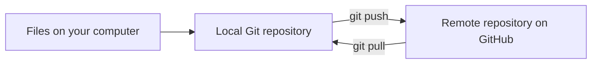
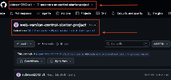
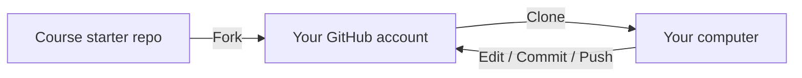
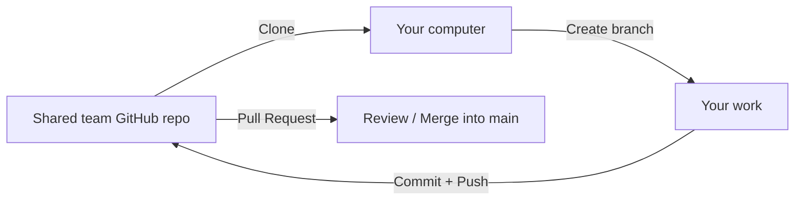
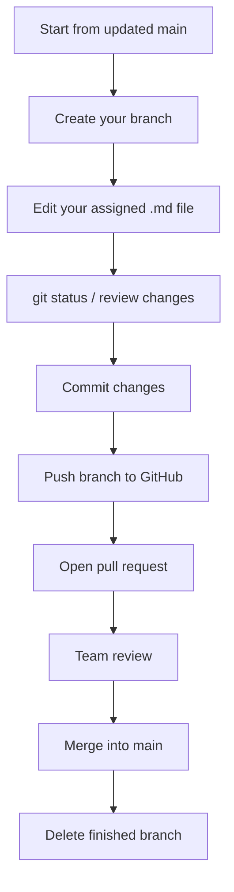
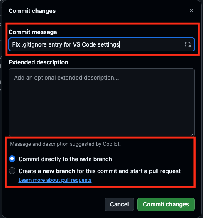
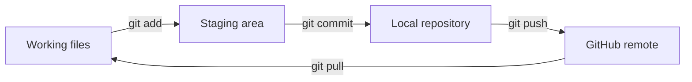
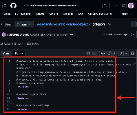
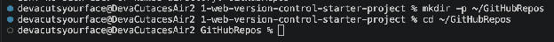

# Git/GitHub Development Environment

**Author:** Courtney    
**Purpose:** Explain the Git/GitHub workflow used in our class projects, including repositories, branches, `.gitignore`, versioning decisions, GitHub Desktop, and basic collaboration.

> **Beginner goal:** You do **not** need to memorize every Git command. You do need to understand where your files are, what Git is tracking, when changes are saved locally, and when they are shared to GitHub.

---

## Table of Contents

1. [Git, GitHub, and GitHub Desktop](#git-github-and-github-desktop)
2. [Key Vocabulary](#key-vocabulary)
3. [Local vs. Remote Repositories](#local-vs-remote-repositories)
4. [Fork vs. Clone vs. Branch](#fork-vs-clone-vs-branch)
5. [Our Two Repository Workflows](#our-two-repository-workflows)
6. [Shared Team Repository Setup](#shared-team-repository-setup)
7. [Recommended Team Branch Workflow](#recommended-team-branch-workflow)
8. [The Git Save-and-Share Workflow](#the-git-save-and-share-workflow)
9. [Working with `.gitignore`](#working-with-gitignore)
10. [What Should and Should Not Be Versioned](#what-should-and-should-not-be-versioned)
11. [GitHub Desktop vs. Command Line](#github-desktop-vs-command-line)
12. [Essential Git Commands](#essential-git-commands)
13. [Commit Messages](#commit-messages)
14. [Pull vs. Pull Request](#pull-vs-pull-request)
15. [GitHub Pages for Team Documentation](#github-pages-for-team-documentation)
16. [Common Problems and Troubleshooting](#common-problems-and-troubleshooting)
17. [Quick Workflow Checklists](#quick-workflow-checklists)
18. [Reliable Resources](#reliable-resources)

---

## Git, GitHub, and GitHub Desktop

These tools work together, but they are **not the same thing**.

| Tool | What It Is | What It Does |
|---|---|---|
| **Git** | Version-control system installed on your computer | Tracks file changes over time, creates commits, supports branches, and lets developers return to earlier versions. |
| **GitHub** | Online/remote repository host | Stores repositories online so work can be backed up, shared, reviewed, and collaborated on. |
| **GitHub Desktop** | Graphical interface for Git | Provides buttons and visual tools for many Git tasks instead of requiring terminal commands. |

A simple way to think about them:

```text
Git = tracks the project
GitHub = hosts/shares the project online
GitHub Desktop = visual controls for Git
```

---

## Key Vocabulary

| Term | Beginner-Friendly Meaning |
|---|---|
| **Repository / Repo** | The project folder Git is tracking. |
| **Local repository** | The copy of the repository stored on your computer. |
| **Remote repository** | The copy hosted online, such as on GitHub. |
| **Working directory** | The files you are currently editing. |
| **Staging area** | The group of changes selected for the next commit. |
| **Commit** | A saved snapshot of staged changes in the **local** repository. |
| **Push** | Sends local commits to GitHub. |
| **Pull** | Brings newer remote changes down to your local repository. |
| **Branch** | A separate line of work inside the same repository. |
| **Main** | The default branch in most new GitHub repositories. |
| **Pull request (PR)** | A request on GitHub to review and merge one branch into another. |
| **Clone** | Downloads a remote repository and creates a connected local copy. |
| **Fork** | Creates a copy of someone else's repository under a different GitHub account. |
| **`.gitignore`** | A file containing patterns for files/folders Git should not track. |

---

## Local vs. Remote Repositories

Our earlier web project used both a local and remote repository:



The **local repository** is where you work. The **remote repository** is where the project is backed up and shared with others.

> A commit is **not automatically on GitHub**. A commit is local until it is pushed.

---

## Fork vs. Clone vs. Branch

These three terms are easy to mix up because all of them create another place to work.

| Action | Where It Creates Something | When We Use It |
|---|---|---|
| **Fork** | On GitHub, under another account | When starting from someone else's repository, such as the Web Version Control Starter Project. |
| **Clone** | On your computer | When you need a local copy of a GitHub repository so you can work on it. |
| **Branch** | Inside the same repository | When you want a safe, separate line of work before merging changes into `main`. |

### Example from our earlier project: forking a starter repository

The starter website project was forked from the original course repository before being cloned locally.



---

## Our Two Repository Workflows

So far, our class work has used **two different Git/GitHub situations**. Knowing which one you are in prevents a lot of confusion.

### Workflow A: Using someone else's starter repository

Example: the earlier Web Version Control Starter Project.



Typical sequence:

1. Fork the original repository.
2. Verify the fork appears under your GitHub account.
3. Clone your fork to your computer.
4. Make and test changes locally.
5. Commit changes.
6. Push commits back to your GitHub fork.

### Workflow B: Working in the team's shared documentation repository

The Django Guided Exploration uses a **shared repository with collaborators**. In this situation, team members normally work in the same GitHub repository rather than each creating a separate fork, unless the instructor/team chooses a fork-based workflow.



The Guided Exploration specifically has the team:

- create a shared GitHub repository;
- add all team members as collaborators;
- decide how the documentation will be organized;
- create Markdown (`.md`) files for major sections;
- set up GitHub Pages; and
- verify that each team member can contribute.

---

## Shared Team Repository Setup

For a new shared class repository, the team should agree on the structure **before everyone starts editing**.

### Suggested setup order

1. One team member creates the repository on GitHub.
2. Add the other team members as collaborators.
3. Decide where documentation files will live.
4. Create the initial `.md` files.
5. Add a README explaining the repository.
6. Add/update `.gitignore` before development files begin appearing.
7. Decide whether the team will:
   - commit directly to `main`, or
   - use branches and pull requests.
8. Set up GitHub Pages for the documentation.
9. Have every team member verify they can clone, branch, commit, push, and/or open a pull request as required.

### Example documentation structure

```text
Django_CS1030_TR/
├── README.md
├── git-github-development-environment.md
├── command-line.md
├── python-fundamentals.md
├── django-framework-setup.md
├── virtual-environments.md
├── packages-and-dependencies.md
├── .gitignore
└── images/
```

---

## Recommended Team Branch Workflow

A **branch** gives one person a contained place to make changes without immediately changing `main`. GitHub's documentation describes branches as a way to develop, fix, or experiment separately from other work.

For a team documentation repository, a simple branch workflow is:



### Beginner branch example

```bash
git switch main
git pull
git switch -c docs/git-github
```

After making changes:

```bash
git status
git add git-github-development-environment.md
git commit -m "Add Git and GitHub workflow documentation"
git push -u origin docs/git-github
```

Then open a pull request on GitHub and request review before merging into `main`.

> **Why this helps:** Two people can work at the same time without both editing `main` directly. It also gives the team a place to review changes before they become part of the main documentation.

### Direct-to-main vs. branch workflow

Our earlier project showed GitHub's option to either commit directly to `main` or create a branch and pull request. Direct commits can be fine for simple individual work, while branches/pull requests are generally more useful when several people are collaborating.



---

## The Git Save-and-Share Workflow

This is the core workflow from the earlier project:

```text
STATUS → DIFF → ADD → COMMIT → PUSH
```

A more complete team version adds pulling first:

```text
PULL → EDIT → STATUS → DIFF → ADD → COMMIT → PUSH → PULL REQUEST
```



### Why inspect before committing?

Use `git status` and `git diff` before `git add` so you know exactly what you are about to save. This is especially important in a Django project because generated files, environment folders, and local settings can appear alongside the files you actually want to version.

---

## Working with `.gitignore`

A `.gitignore` file tells Git which files and folders it should ignore when tracking project history.

The earlier website project used `.gitignore` to avoid committing operating-system and local editor files. The Django Guided Exploration also required verifying that the `djvenv` virtual-environment directory was **not tracked**.

### Course-based `.gitignore` example

```gitignore
# macOS system files
.DS_Store

# Windows system files
Thumbs.db

# VS Code local settings
.vscode/

# Python virtual environment used in this project
djvenv/
```



### Common additions you may see in later Python/Django projects

These were not all required in the earlier class document, but they are common Git exclusions:

```gitignore
# Python cache files
__pycache__/
*.py[cod]

# Local secrets/environment variables
.env
```

> **Important:** The `.gitignore` file itself **should be versioned**. That allows everyone who clones the repository to use the same ignore rules.

### `.gitignore` does not remove a file that is already tracked

If a file was committed before it was added to `.gitignore`, Git may continue tracking it. GitHub's documentation recommends untracking it first:

```bash
git rm --cached FILE-NAME
```

Then commit the change.

---

## What Should and Should Not Be Versioned

### Files we should normally version for these class projects

| File / Folder | Version It? | Why |
|---|---:|---|
| `README.md` | Yes | Explains the repository/project. |
| Technical documentation `.md` files | Yes | They are the actual team documentation. |
| `.gitignore` | Yes | Shares ignore rules with the team. |
| Python source files (`.py`) | Yes | They are project source code. |
| HTML/templates | Yes | They are project source files. |
| CSS / JavaScript | Yes | They are project source files. |
| `requirements.txt` | Yes | Records package/version information so another developer can recreate the environment. |
| Django project/application files created for the project | Yes | They are part of the application's tracked source/configuration unless the instructor says otherwise. |

### Files we should normally **not** version for these class projects

| File / Folder | Version It? | Why Not |
|---|---:|---|
| `djvenv/` | No | It is the local virtual environment and contains installed packages/environment files that can be recreated. |
| `.DS_Store` | No | macOS folder-display metadata; unrelated to the project. |
| `Thumbs.db` | No | Windows-generated folder thumbnail data; unrelated to the project. |
| `.vscode/` | No for our course setup | Local editor settings were excluded in the earlier project. |
| `__pycache__/` and compiled Python cache files | No | Generated automatically and can be recreated. |
| `.env` or files containing secrets | No | Passwords, tokens, and secret values should not be committed to GitHub. |

### Why `requirements.txt` is versioned but `djvenv/` is not

The Django Guided Exploration made this distinction directly:

- `requirements.txt` is small and records the dependency versions another developer needs.
- `djvenv/` contains a local copy of installed packages and environment files, can be large, and may be specific to the computer.

That means another developer can clone the project and **recreate** the environment rather than downloading your entire virtual environment.

---

## GitHub Desktop vs. Command Line

Our earlier technical document used the VS Code terminal, but GitHub Desktop can perform many of the same Git actions visually.

| Task | GitHub Desktop | Command Line |
|---|---|---|
| Clone repository | **File → Clone Repository** or open from GitHub | `git clone REPO-URL` |
| View changed files | Changes panel | `git status` / `git diff` |
| Commit | Enter summary → **Commit** | `git add ...` then `git commit -m "..."` |
| Pull remote changes | **Fetch origin / Pull origin** | `git pull` |
| Push commits | **Push origin** | `git push` |
| Create/switch branch | **Current Branch** menu | `git switch -c BRANCH` / `git switch BRANCH` |
| Open pull request | **Create Pull Request** | Usually opened on GitHub after pushing the branch |

### Which should a beginner use?

Either is valid unless the assignment requires a specific method.

- **GitHub Desktop** is helpful when you want a visual list of changed files, branches, commits, and conflicts.
- **Command line** is useful because the same Git commands work across many development tools and are easy to document/repeat.

This document only gives the Git commands needed to understand the workflow because the team has a separate command-line technical document.

---

## Essential Git Commands

| Command | What It Does |
|---|---|
| `git clone REPO-URL` | Downloads a remote repository and creates a connected local copy. |
| `git status` | Shows changed, staged, and untracked files. |
| `git diff` | Shows the actual unstaged file changes. |
| `git add FILE-NAME` | Stages one file for the next commit. |
| `git add .` | Stages all current changes in the repository. Use carefully. |
| `git commit -m "MESSAGE"` | Creates a local commit containing the staged changes. |
| `git pull` | Pulls newer remote commits into the current local branch. |
| `git push` | Sends local commits to the connected remote branch. |
| `git log --oneline` | Shows a compact commit history. |
| `git branch` | Lists local branches. |
| `git switch -c BRANCH-NAME` | Creates a new branch and switches to it. |
| `git switch BRANCH-NAME` | Switches to an existing branch. |
| `git remote -v` | Shows the remote repository URLs connected to the local repo. |

### Terminal folder setup used in the earlier project

```bash
mkdir -p ~/GitHubRepos
cd ~/GitHubRepos
```



Then the earlier project cloned the repository with:

```bash
git clone REPO-URL
```

---

## Commit Messages

A good commit message briefly explains **what changed**.

### Better examples

```text
Add GitHub branch workflow section
Fix broken link in Django setup guide
Update .gitignore for djvenv
Clarify requirements.txt explanation
```

### Weak examples

```text
stuff
changes
fixed it
final final final
```

A commit message should help a teammate understand the history without opening every changed file. Future-you also counts as a teammate. Unfortunately, future-you is very judgmental.

---

## Pull vs. Pull Request

These terms sound related but mean different things.

| Term | Meaning |
|---|---|
| **`git pull`** | Downloads newer commits from the remote repository and integrates them into your current local branch. |
| **Pull request (PR)** | A GitHub collaboration feature asking to review and merge one branch into another. |

### Good habit for a shared repository

Before starting new work on `main`:

```bash
git switch main
git pull
```

Then create your branch.

This reduces the chance of starting from an outdated copy of the project.

---

## GitHub Pages for Team Documentation

The Guided Exploration requires the team's Markdown documentation to be published using GitHub Pages.

For a simple documentation repository, GitHub can publish from a branch:

1. Open the repository on GitHub.
2. Go to **Settings → Pages**.
3. Under **Build and deployment**, select **Deploy from a branch**.
4. Select the branch and source folder your team is using (often `main` and `/` root, depending on the team's setup).
5. Save the configuration.
6. After changes are pushed/merged into the publishing source, verify the Pages site updates.

> Do not place secrets or private information in a Pages publishing source. GitHub Pages produces a website, not a private storage locker wearing a fake mustache.

---

## Common Problems and Troubleshooting

### Problem: `remote: Repository not found` / `fatal: repository not found`

This happened during our Django project when the remote URL contained a typo.

Check the connected remote:

```bash
git remote -v
```

Then verify:

- GitHub username/organization name;
- repository name;
- spelling and capitalization;
- whether you have permission to access the repository.

A single missing character in the remote URL can stop a push completely.

---

### Problem: Git is tracking something that should be ignored

1. Add the file/folder pattern to `.gitignore`.
2. If it was already tracked, untrack it:

```bash
git rm --cached FILE-NAME
```

For a tracked directory, the command may require the recursive option:

```bash
git rm -r --cached DIRECTORY-NAME
```

3. Check the result:

```bash
git status
```

4. Commit the correction.

---

### Problem: Push is rejected because the remote has newer work

In a shared repository, another teammate may have pushed first.

Start with:

```bash
git status
git pull
```

If Git reports a merge conflict, resolve the conflict before pushing again.

---

### Problem: Merge conflict

A merge conflict happens when Git cannot safely decide how two competing changes should be combined—for example, two people changed the same line.

Basic resolution process:

1. Run `git status` to identify conflicted files.
2. Open the conflicted file in VS Code or another editor.
3. Decide which content should remain.
4. Remove conflict markers if present.
5. Stage the resolved file.
6. Commit the resolution.
7. Push the updated branch.

```bash
git add FILE-NAME
git commit -m "Resolve merge conflict"
git push
```

> Do not blindly choose "mine" or "theirs" just to make the red warning disappear. That is how perfectly good code becomes a group project crime scene.

---

### Problem: You are not sure what Git is about to commit

Stop and inspect before doing anything else:

```bash
git status
git diff
```

If you already staged files and want to review the staged version:

```bash
git diff --staged
```

---

## Quick Workflow Checklists

### Shared team documentation repository

- [ ] I cloned the correct shared repository.
- [ ] I pulled the newest `main` before starting.
- [ ] I created/switched to my branch if the team is using branches.
- [ ] I edited my assigned Markdown file.
- [ ] I ran `git status`.
- [ ] I reviewed the changes before committing.
- [ ] I staged only the files I intended to include.
- [ ] I wrote a descriptive commit message.
- [ ] I pushed my branch/commits to GitHub.
- [ ] I opened a pull request if required.
- [ ] I reviewed teammate feedback and updated documentation when needed.
- [ ] I verified the GitHub Pages site after changes were merged/published.

### Individual Django repository

The Guided Exploration checkpoint expects you to verify that you have:

- [ ] Created the individual local Git repository and connected it to GitHub.
- [ ] Created `requirements.txt`.
- [ ] Created/updated `.gitignore`.
- [ ] Verified that `djvenv/` is not tracked.
- [ ] Inspected the repository before committing.
- [ ] Committed the working project.
- [ ] Pushed the project to GitHub.

---

## Reliable Resources

### Official GitHub documentation

- [GitHub Docs — Ignoring files](https://docs.github.com/en/get-started/getting-started-with-git/ignoring-files)
- [GitHub Docs — Branches](https://docs.github.com/en/pull-requests/reference/branches)
- [GitHub Docs — Managing branches](https://docs.github.com/en/pull-requests/how-tos/commit-changes/managing-branches-within-your-repository)
- [GitHub Docs — Inviting collaborators](https://docs.github.com/en/repositories/managing-your-repositorys-settings-and-features/repository-access-and-collaboration/inviting-collaborators-to-a-personal-repository)
- [GitHub Docs — Cloning to GitHub Desktop](https://docs.github.com/en/desktop/adding-and-cloning-repositories/cloning-a-repository-from-github-to-github-desktop)
- [GitHub Docs — Syncing a branch in GitHub Desktop](https://docs.github.com/en/desktop/working-with-your-remote-repository-on-github-or-github-enterprise/syncing-your-branch-in-github-desktop)
- [GitHub Docs — Merge conflicts](https://docs.github.com/en/pull-requests/reference/merge-conflicts)
- [GitHub Docs — Configuring a GitHub Pages publishing source](https://docs.github.com/en/pages/getting-started-with-github-pages/configuring-a-publishing-source-for-your-github-pages-site)

### Course/project sources used to build this page

- Existing **GitHub, VS Code, HTML, CSS, & Bootstrap** technical document.
- **Django GE02: Development Environment and Django Setup** Guided Exploration.

---

## One-Minute Summary

```text
Git tracks changes.
GitHub hosts and shares repositories.
Clone = GitHub → your computer.
Commit = save a snapshot locally.
Push = local commits → GitHub.
Pull = GitHub updates → your local branch.
Branch = separate line of work.
Pull request = ask to review/merge a branch.
.gitignore = keep generated/local/sensitive files out of version control.
requirements.txt = version it.
djvenv/ = do not version it.
```
