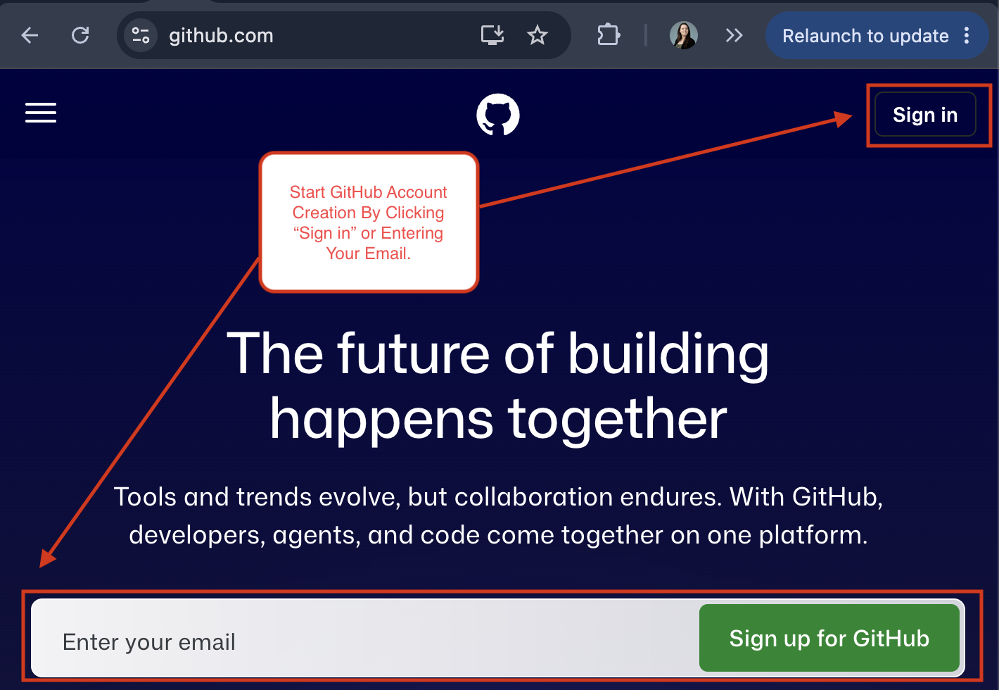
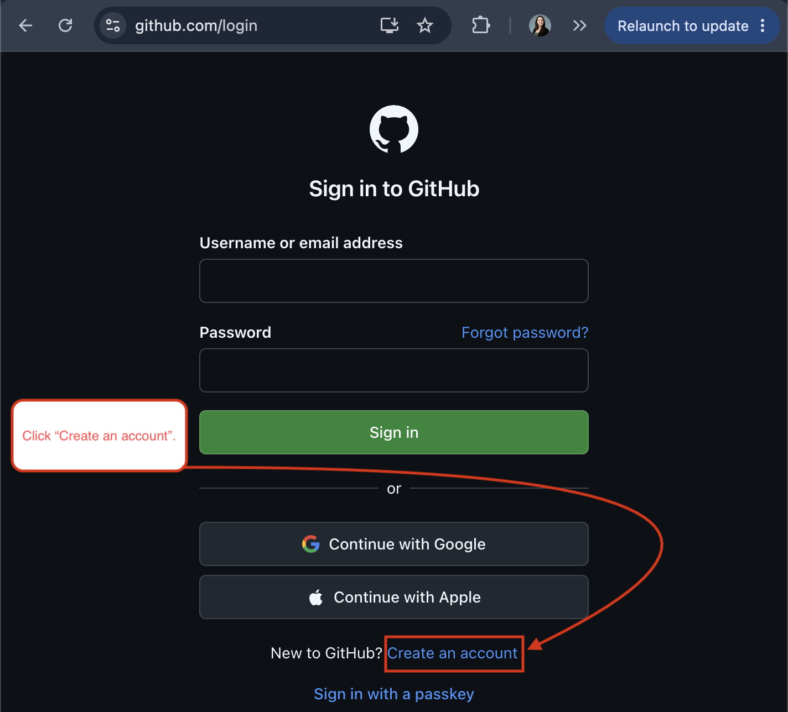
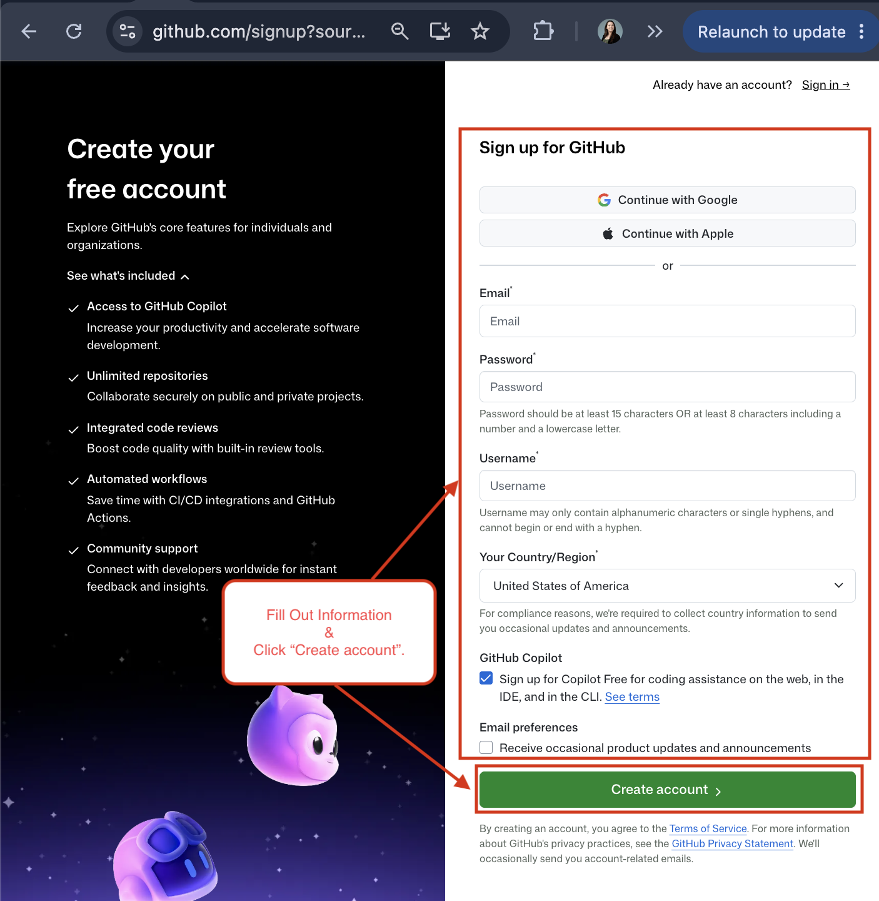
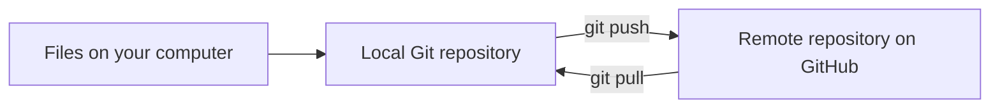
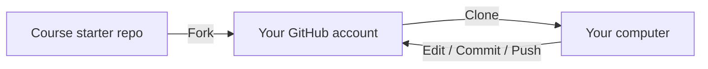
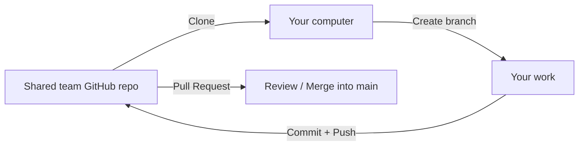

# Git/GitHub Development Environment

**Author:** Courtney Brown  
**Purpose:** Explain the Git/GitHub workflow used in our projects, including repositories, branches, and `.gitignore`.

> **Beginner goal: Understand what Git, GitHub, and GitHub Destop are and how to work through basic repository workflows. 

---

## Table of Contents

1. [Explaining Git, GitHub, and GitHub Desktop](#explaining-git-github-and-github-desktop)
2. [Setting Up Git Account](#setting-up-git-account)
3. [Key Vocabulary](#key-vocabulary)
4. [Local vs. Remote Repositories](#local-vs-remote-repositories)
5. [Fork vs. Clone vs. Branch](#fork-vs-clone-vs-branch)
6. [Forking A Repo](#forking-a-repo)
7. [Creating and Collaborating In A Shared Repo](#creating-and-collaborating-in-a-shared-repo)
8. [Reliable Resources](#reliable-resources)

---

## Explaining Git, GitHub, and GitHub Desktop

These tools work together, but they are **not the same thing**.

| Tool | What It Is | What It Does |
|---|---|---|
| **Git** | Version-control system installed on your computer | Tracks file changes over time, creates commits, supports branches, and lets developers return to earlier versions. |
| **GitHub** | Online/remote repository host | Stores repositories online so work can be backed up, shared, reviewed, and collaborated on. |
| **GitHub Desktop** | Graphical interface for Git | Provides buttons and visual tools for many Git tasks instead of requiring terminal commands. |

A simple way to think about them:

```text
Git = tracks the project (Version-Control System)
GitHub = hosts/shares/backsup the project online (Online Version of Git)
GitHub Desktop = visual controls for Git (Desktop Application to Simplify Git Tasks)
```

---

## Setting Up Git Account

If you do not have a Git/GitHub account, follow these instructions to set one up.

1. Go to [GitHub's website](https://github.com/).

2. Begin the account creation process by entering your email on the GitHub home page or by clicking **Sign in** in the top-right corner.

   The steps below use the **Sign in** method.

   

3. On the sign-in page, click the **Create an account** link below the sign-in options.

   

5. Fill in the required account information and click the green **Create account** button at the bottom of the page.

   

Your account is now set up, and you are ready to move into the basics. Below covers: 
- Git Basics/Vocabulary
- Working With Two Different Workflow Types

---

## Key Vocabulary

| Term | Beginner-Friendly Meaning |
|---|---|
| **Repository / Repo** | The project folder Git is tracking. |
| **Local repository** | The copy of the repository stored on your computer. |
| **Remote repository** | The copy hosted online, such as on GitHub. |
| **Working directory** | The files you are currently editing. |
| **Staging area** | The group of changes selected for the next commit. |
| **Commit** | A saved snapshot of staged changes in the **local** repository. |
| **Push** | Sends local commits to GitHub. |
| **Pull** | Brings newer remote changes down to your local repository. |
| **Branch** | A separate line of work inside the same repository. |
| **Main** | The default branch in most new GitHub repositories. |
| **Pull request (PR)** | A request on GitHub to review and merge one branch into another. |
| **Clone** | Downloads a remote repository and creates a connected local copy. |
| **Fork** | Creates a copy of someone else's repository under a different GitHub account. |
| **`.gitignore`** | A file containing patterns for files/folders Git should not track. |

---

## Local vs. Remote Repositories

The **local repository** is where you work. The **remote repository** backs up the project and shares it with others.



> A commit does **not automatically go to GitHub/online back up**. A commit stays local until you push it.

---

## Fork vs. Clone vs. Branch

These three terms are easy to mix up because all of them create another place to work.

| Action | Where It Creates Something | When We Use It |
|---|---|---|
| **Fork** | On GitHub (online), under another account | When starting from someone else's repository, such as the Web Version Control Starter Project. |
| **Clone** | On your computer (local) | When you need a local copy of a GitHub repository so you can work on it. |
| **Branch** | Inside the same repository | When you want a safe, separate line of work before merging changes into `main`. |

---

## Forking A Repo

Example: The earlier Web Version Control Starter Project.



Typical sequence:

1. Fork the original repository.
2. Verify the fork appears under your GitHub account.
3. Clone your fork to your computer.
4. Make and test changes locally.
5. Commit changes.
6. Push commits back to your GitHub fork.

## Creating and Collaborating In A Shared Repo

Example: A team works in a shared repository with collaborators. In this situation, team members normally work in the same GitHub repository rather than each creating a separate fork, unless the team chooses a fork-based workflow.



Typical Sequence:

1. Create a shared GitHub repository
2. Add all team members as collaborators;
3. Decide how the documentation will be organized;
4. Create Markdown (`.md`) files for major sections;
5. Set up GitHub Pages; and
6. Verify that each team member can contribute.

---

## Reliable Resources

### Official GitHub documentation

- [GitHub Docs — Ignoring files](https://docs.github.com/en/get-started/getting-started-with-git/ignoring-files)
- [GitHub Docs — Branches](https://docs.github.com/en/pull-requests/reference/branches)
- [GitHub Docs — Managing branches](https://docs.github.com/en/pull-requests/how-tos/commit-changes/managing-branches-within-your-repository)
- [GitHub Docs — Inviting collaborators](https://docs.github.com/en/repositories/managing-your-repositorys-settings-and-features/repository-access-and-collaboration/inviting-collaborators-to-a-personal-repository)
- [GitHub Docs — Cloning to GitHub Desktop](https://docs.github.com/en/desktop/adding-and-cloning-repositories/cloning-a-repository-from-github-to-github-desktop)
- [GitHub Docs — Syncing a branch in GitHub Desktop](https://docs.github.com/en/desktop/working-with-your-remote-repository-on-github-or-github-enterprise/syncing-your-branch-in-github-desktop)
- [GitHub Docs — Merge conflicts](https://docs.github.com/en/pull-requests/reference/merge-conflicts)
- [GitHub Docs — Configuring a GitHub Pages publishing source](https://docs.github.com/en/pages/getting-started-with-github-pages/configuring-a-publishing-source-for-your-github-pages-site)

### Course/Project Sources Used To Build This Page

- Existing **M02 L04 CP Developer** Tech Doc.
- Existing **Set up Version Control and IDE for aWebsite** Tech Doc.
- Personal **GitHub, VS Code, HTML, CSS, & Bootstrap** Tech Doc.

### Other Resources Used To Build This Page & How They Were Utilized
- **ChatGPT**
  - Helped revise and format the Google tech doc into a .md file.
  - Helped troubleshoot certain sections when walls were hit

---

## One-Minute Summary

```text
Git tracks changes.
GitHub hosts and shares repositories.
Clone = GitHub → your computer.
Commit = save a snapshot locally.
Push = local commits → GitHub.
Pull = GitHub updates → your local branch.
Branch = separate line of work.
Pull request = ask to review/merge a branch.
.gitignore = keep generated/local/sensitive files out of version control.
requirements.txt = version it.
djvenv/ = do not version it.
```
